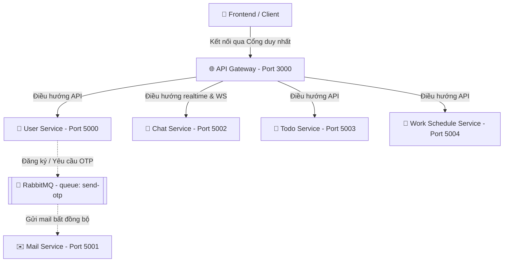

# 🚀 Chat & Work Management System (Backend Microservices)

Hệ thống Backend được thiết kế theo kiến trúc **Microservices** phục vụ cho ứng dụng Chat và Quản lý công việc. Các dịch vụ được chia nhỏ thành các kho lưu trữ (repository) riêng biệt trên GitHub nhưng được kết nối đồng bộ và hoạt động thống nhất với nhau qua **API Gateway**, **RabbitMQ** (truyền tin nhắn bất đồng bộ), và **Redis** (caching).

---

## 🔗 Danh Sách Các Dịch Vụ & GitHub Repositories

Dưới đây là liên kết chi tiết tới các repository của từng dịch vụ cấu thành nên toàn bộ hệ thống:

| Tên Dịch Vụ (Service Name) | Vai Trò (Role) | Cổng (Port) | GitHub Repository |
| :--- | :--- | :---: | :--- |
| 🌐 **API Gateway** | Cửa ngõ định tuyến HTTP & WebSockets (Socket.io), gộp tài liệu Swagger | `3000` | [👉 API-GATEWAY](https://github.com/lethanh2006/API-GATEWAY) |
| 👤 **User Service** | Xác thực người dùng, JWT, phân quyền, quản lý tài khoản | `5000` | [👉 USER_SERVICE](https://github.com/lethanh2006/USER_SERVICE) |
| ✉️ **Mail Service** | Gửi OTP bất đồng bộ bằng cách tiêu thụ hàng đợi RabbitMQ | `5001` | [👉 MAIL_SERVICE](https://github.com/lethanh2006/MAIL_SERVICE) |
| 💬 **Chat Service** | Trò chuyện thời gian thực, lưu trữ tin nhắn và media (Cloudinary) | `5002` | [👉 CHAT_SERVICE](https://github.com/lethanh2006/CHAT_SERVICE) |
| 📝 **Todo Service** | Quản lý danh sách công việc, nhiệm vụ cá nhân và nhóm | `5003` | [👉 TODO_SERVICE](https://github.com/lethanh2006/TODO_SERVICE) |
| 📅 **Work Schedule Service** | Quản lý ca làm việc, lịch biểu, chấm công và các chính sách | `5004` | [👉 WORKSCHEDULE_SERVICE](https://github.com/lethanh2006/WORKSCHEDULE_SERVICE) |

---

## 🛠️ Cơ Chế Kết Nối Hệ Thống (System Integration)

Các dịch vụ không hoạt động rời rạc mà được gắn kết chặt chẽ theo mô hình sau:



* **API Gateway (Port 3000)** là cổng giao tiếp duy nhất giữa Frontend và Backend. Cả HTTP request thông thường và kết nối realtime Socket.io đều đi qua Gateway.
* **RabbitMQ** đóng vai trò cầu nối trung gian giúp giải phóng tài nguyên cho User Service khi cần gửi email OTP.
* **Tài liệu API tập trung**: Gateway tự động truy vấn thông tin Swagger từ các service và hiển thị tập trung tại `http://localhost:3000/api-docs`.

---

## 🚀 Hướng Dẫn Khởi Chạy Nhanh (Quick Start)

1. **Khởi động các dịch vụ hạ tầng**: Đảm bảo **MongoDB** (database `nrapp`), **Redis** (cổng `6379`) và **RabbitMQ** (cổng `5672`) đang chạy.
2. **Cài đặt thư viện**: Di chuyển vào từng thư mục và chạy:
   ```bash
   npm install
   ```
3. **Cấu hình biến môi trường**: Tạo file `.env` cho từng dịch vụ dựa trên các cấu hình mẫu hoặc file hướng dẫn `doc.txt`.
4. **Chạy ứng dụng**: Chạy lệnh sau ở từng thư mục dịch vụ:
   ```bash
   npm run dev
   ```
